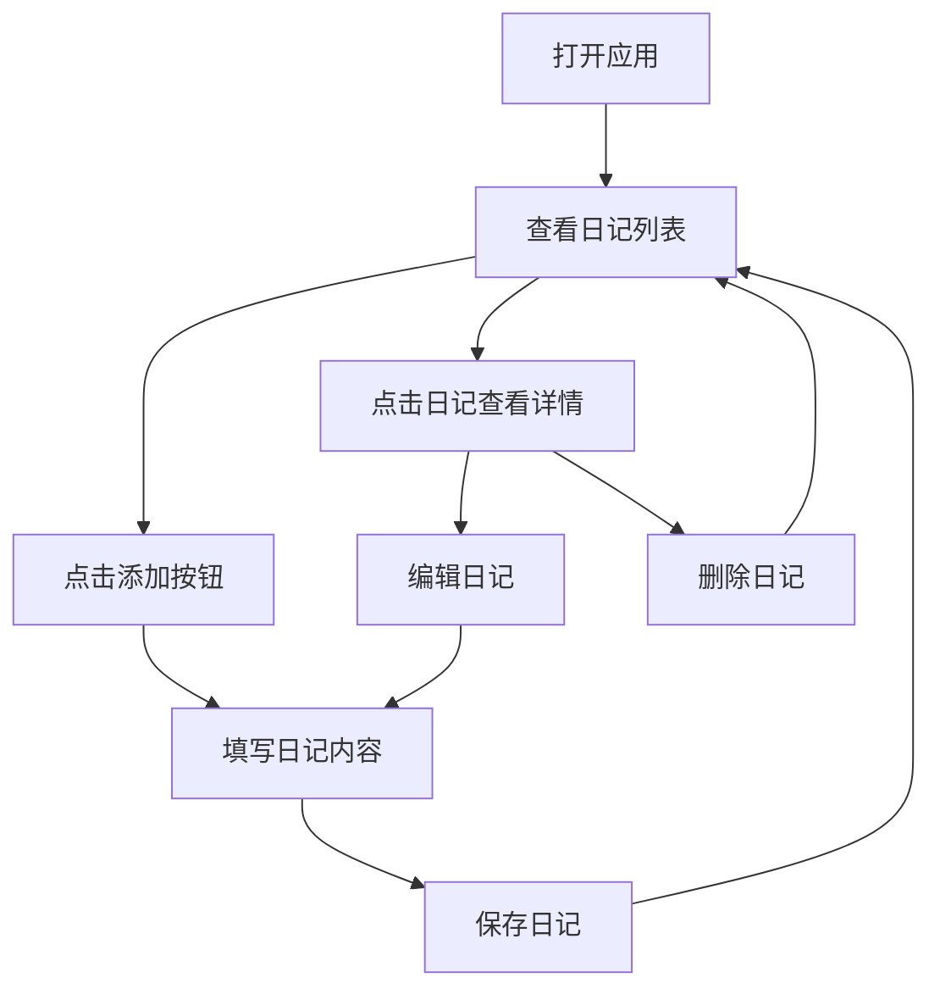

## 1. Product Overview
日记本网页是一个简洁优雅的在线日记记录工具，帮助用户记录日常生活和个人思考。
- 提供直观的界面让用户轻松创建、编辑和管理日记条目，解决传统纸质日记易丢失、难整理的问题。
- 目标用户为需要记录个人生活、情感和想法的人群，强调隐私性和用户体验。

## 2. Core Features

### 2.1 User Roles
| Role | Registration Method | Core Permissions |
|------|---------------------|------------------|
| 普通用户 | 本地存储（无需注册） | 创建、编辑、删除、查看日记 |

### 2.2 Feature Module
1. **主页面**: 日记列表、添加日记按钮、搜索功能
2. **日记编辑页**: 标题编辑、内容编辑、保存功能
3. **日记详情页**: 完整日记内容、编辑按钮、删除按钮

### 2.3 Page Details
| Page Name | Module Name | Feature description |
|-----------|-------------|---------------------|
| 主页面 | 日记列表 | 显示所有日记条目，按日期倒序排列，显示标题和简短内容预览 |
| 主页面 | 添加日记按钮 | 点击后跳转到日记编辑页，创建新日记 |
| 主页面 | 搜索功能 | 支持按标题和内容搜索日记条目 |
| 日记编辑页 | 标题编辑 | 允许用户输入日记标题 |
| 日记编辑页 | 内容编辑 | 提供富文本编辑器，支持基本格式和换行 |
| 日记编辑页 | 保存功能 | 保存日记到本地存储，自动返回主页面 |
| 日记详情页 | 完整日记内容 | 显示日记的完整标题和内容，包括日期信息 |
| 日记详情页 | 编辑按钮 | 点击后跳转到日记编辑页，修改现有日记 |
| 日记详情页 | 删除按钮 | 点击后删除当前日记，返回主页面 |

## 3. Core Process
用户流程：用户打开应用 → 查看日记列表 → 点击添加按钮创建新日记 → 填写标题和内容 → 保存日记 → 返回日记列表查看新添加的日记 → 点击日记查看详情 → 可选择编辑或删除日记。

## 4. User Interface Design
### 4.1 Design Style
- 主色调：柔和的浅蓝色 (#E6F3FF) 和白色 (#FFFFFF)
- 强调色：深蓝色 (#2A629E) 和淡粉色 (#FFE6E6)
- 按钮风格：圆角设计，轻微的阴影效果
- 字体：主要使用无衬线字体，标题使用较大字号和中等粗细
- 布局风格：卡片式设计，简洁明了，留有足够的留白
- 图标风格：简约线性图标，搭配柔和的色彩

### 4.2 Page Design Overview
| Page Name | Module Name | UI Elements |
|-----------|-------------|-------------|
| 主页面 | 日记列表 | 卡片式布局，每个卡片显示日记标题、日期和内容预览，鼠标悬停时有轻微的阴影效果和缩放动画 |
| 主页面 | 添加日记按钮 | 固定在右下角的圆形按钮，使用强调色，带有加号图标，悬停时轻微放大 |
| 主页面 | 搜索功能 | 顶部的搜索框，带有搜索图标，输入时显示清除按钮 |
| 日记编辑页 | 标题编辑 | 顶部的文本输入框，使用较大字号，带有 placeholder 提示 |
| 日记编辑页 | 内容编辑 | 下方的文本区域，支持自动换行，留有足够的编辑空间 |
| 日记编辑页 | 保存功能 | 顶部的保存按钮，使用强调色，点击时有反馈动画 |
| 日记详情页 | 完整日记内容 | 居中布局，标题使用较大字号，内容使用舒适的行间距，日期显示在标题下方 |
| 日记详情页 | 编辑按钮 | 顶部的编辑图标按钮，悬停时变色 |
| 日记详情页 | 删除按钮 | 顶部的删除图标按钮，使用红色，悬停时有确认提示 |

### 4.3 Responsiveness
采用移动优先的响应式设计，在不同屏幕尺寸下自动调整布局：
- 桌面端：多列布局，显示更多日记内容
- 平板端：双列布局，保持良好的阅读体验
- 移动端：单列布局，优化触摸交互，确保按钮易于点击

### 4.4 3D Scene Guidance
不适用，本项目为纯2D网页应用。