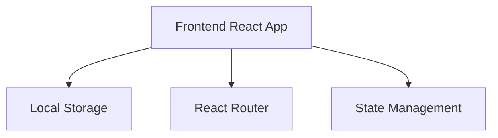
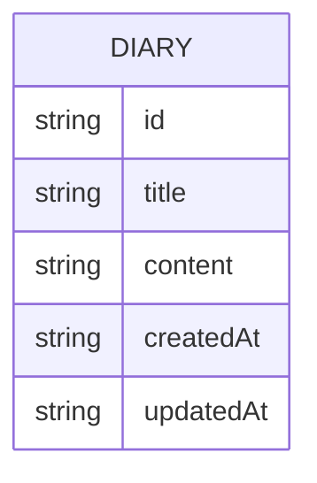

## 1. Architecture Design


## 2. Technology Description
- Frontend: React@18 + tailwindcss@3 + vite
- Initialization Tool: vite-init
- Backend: None (使用本地存储)
- Database: Local Storage (浏览器本地存储)

## 3. Route Definitions
| Route | Purpose |
|-------|---------|
| / | 主页面，显示日记列表 |
| /edit/:id | 日记编辑页，创建或编辑日记 |
| /detail/:id | 日记详情页，查看完整日记 |

## 4. API Definitions
不适用，本项目使用本地存储，不需要后端API。

## 5. Server Architecture Diagram
不适用，本项目为纯前端应用。

## 6. Data Model
### 6.1 Data Model Definition


### 6.2 Data Definition Language
不适用，本项目使用本地存储，不需要数据库表结构。

### 6.3 Local Storage Structure
```javascript
// 本地存储的数据结构
const diaries = [
  {
    id: "1",
    title: "今天的心情",
    content: "今天天气很好，心情也不错...",
    createdAt: "2023-10-01T10:00:00",
    updatedAt: "2023-10-01T10:00:00"
  }
]
```